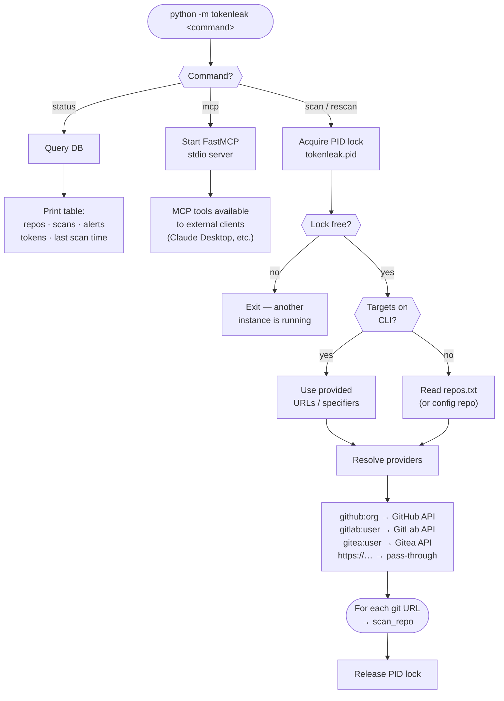
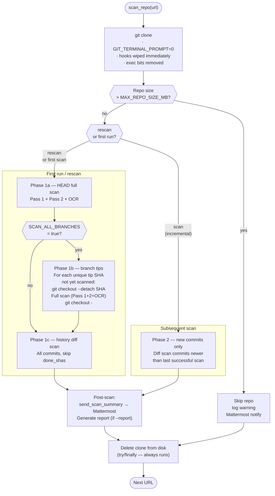
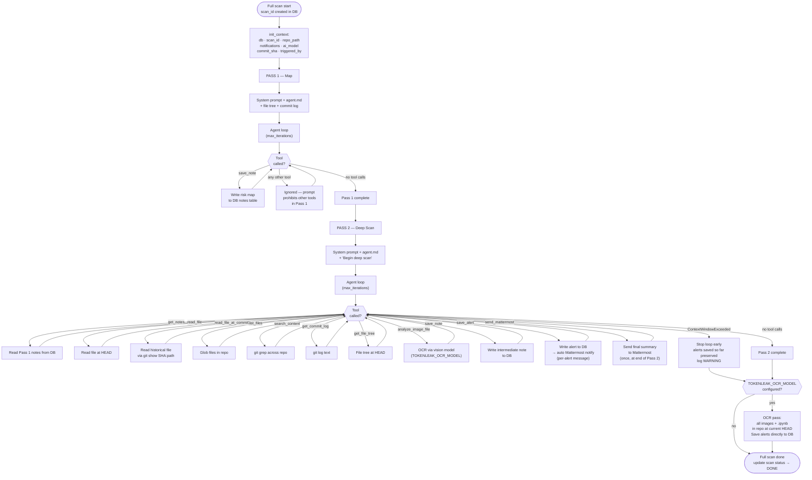
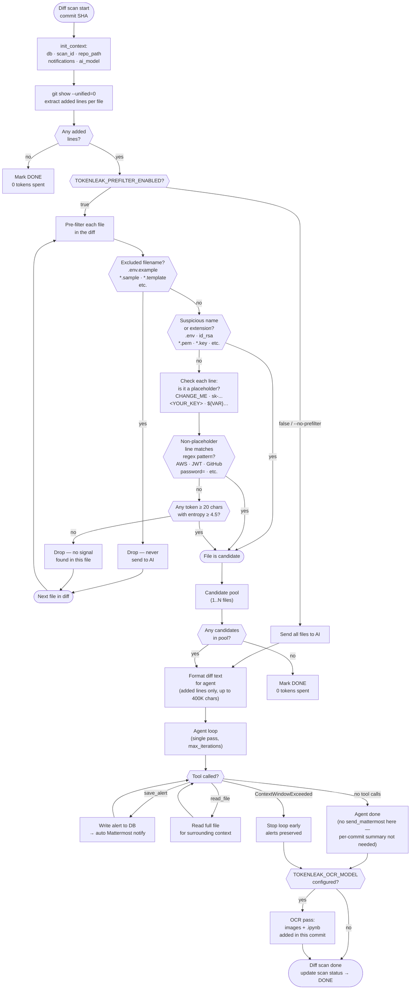

# TokenLeak — Application Flow

Four diagrams cover the complete execution path: command dispatch, per-repository
orchestration, full scan agent interaction, and diff scan pre-filter decision.

---

## 1. Command dispatch



---

## 2. Per-repository orchestration



---

## 3. Full scan — agent and MCP interaction

One full scan consists of two agent passes followed by an optional OCR pass.
MCP tools are called directly in-process (no stdio transport overhead).



---

## 4. Diff scan — pre-filter and agent

Each commit in the history is processed as a diff scan.
The pre-filter runs locally (no AI calls) and decides whether to involve the agent.



---

## Error handling across all scan modes

| Error | Behaviour |
|-------|-----------|
| `InsufficientFundsError` (API billing) | Scanning stops immediately; all in-progress scans marked ERROR; user sees clear message |
| `ContextWindowExceededError` | Current agent loop stops; alerts saved so far are kept; scan continues to next commit |
| Tool call with invalid JSON arguments | Runner repairs escape sequences; if unrecoverable, returns error to agent as tool result; agent loop continues |
| Clone failure | Scan row marked ERROR; clone dir cleaned up; next URL processed |
| Branch tip checkout failure | Branch tip scan marked ERROR; `git checkout -` attempted in finally block; diff history scan continues |
| Mattermost send failure | Logged as WARNING; never stops a scan |
```
